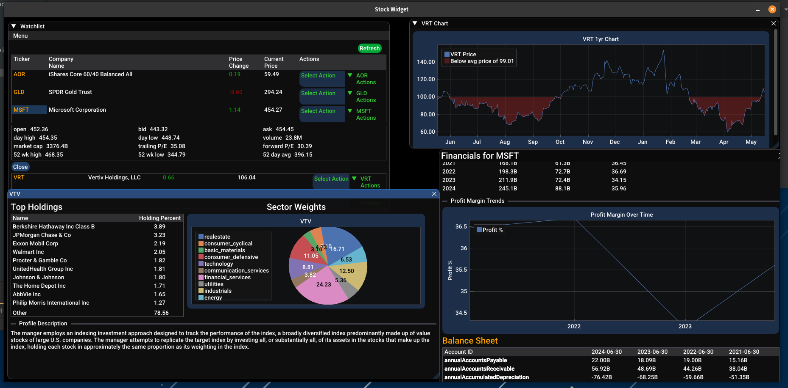

# StockWidget

StockWidget is a graphical desktop application, FOR LINUX OS ONLY, that displays real-time stock market data using OpenGL, ImGui, and GLFW.

## Features

* Live stock quote retrieval via Yahoo Finance API
* Interactive user interface built with ImGui

## Prerequisites for building from source

* To use this program you have to sign up for an api offered on the rapidapi.com marketplace.
The link below is the API the program is built on. The API comes with a free tier, although, I do recommend the $10 tier.
The free tier only comes with 500 calls per month.

* https://rapidapi.com/3b-data-3b-data-default/api/yahoo-finance-real-time1

* Note: I do not make any money off this api, It is just the api i decided to build on based on price and information availability.


Ensure you have the following installed on your system:

* C++17 compatible compiler
* CMake (version 3.22 or higher)
* Git
* Dependencies:

  * `libcrypto++-dev`
  * `libjsoncpp-dev`
  * `libcurl4-openssl-dev`
  * `libglfw3`
  * `libgl1`
  * `libx11-6`
  * `libxrandr2`
  * `libxi6`
  * `libxcursor1`
  * `libwayland-dev`
  * `libxkbcommon-dev`
  * `xorg-dev`

## Build from Source

```bash
git clone git@github.com:jdubzanon/StockWidget.git
cd StockWidget
mkdir build && cd build
cmake ..
cmake --build .
./StockWidget
```
You must uncomment out , commented out code from cmake to build from source, see CMakeLists.txt.
## Download and Install

Download the latest release `.deb` package and install it:

```bash
wget https://github.com/jdubzanon/StockWidget/releases/download/1.11/stockwidget_1.11-1_amd64.deb
sudo apt install ./stockwidget_1.0-1_amd64.deb
```

# To Uninstall Program
```bash
sudo dpkg -r StockWidget
cd ~/.local/share
rm -rf stock_widget
```


Follow the prompts to confirm package metadata.

## Usage

After installation, launch the app from your application menu or run:

```bash
StockWidget
```

# Example of UI




## Contributing

Contributions are welcome! Feel free to open issues or submit pull requests.

## License

Specify your license here, e.g., MIT License. You can include a `LICENSE.md` file for full details.

